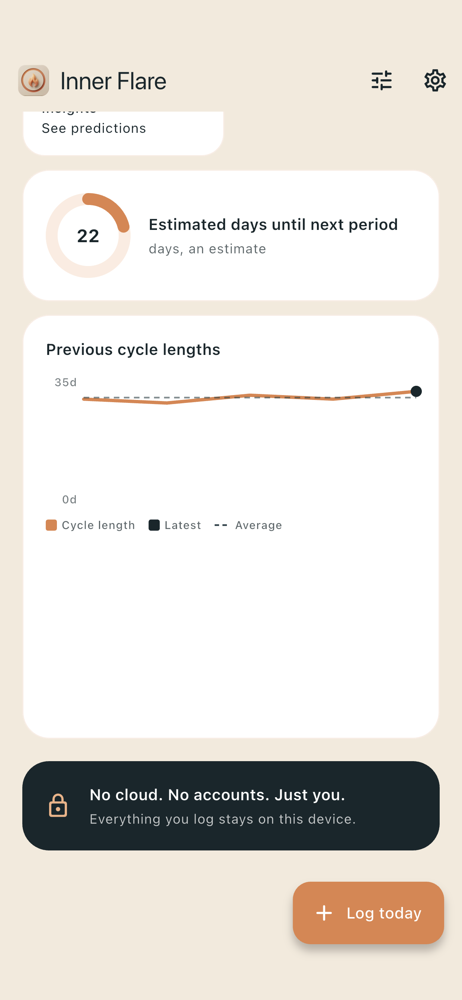
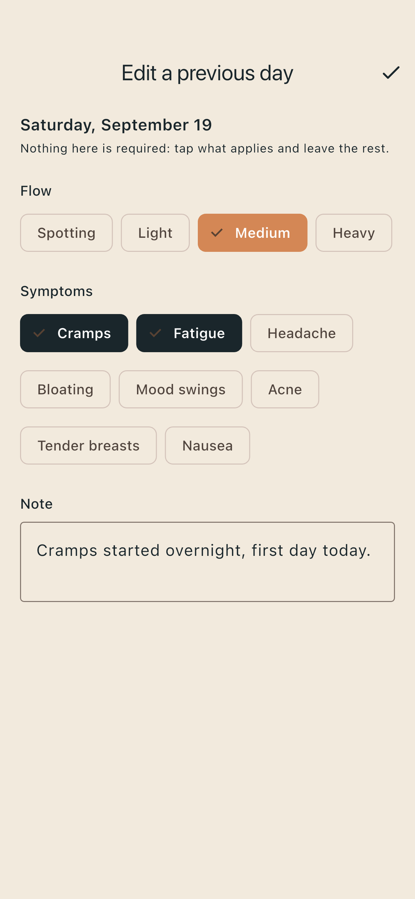
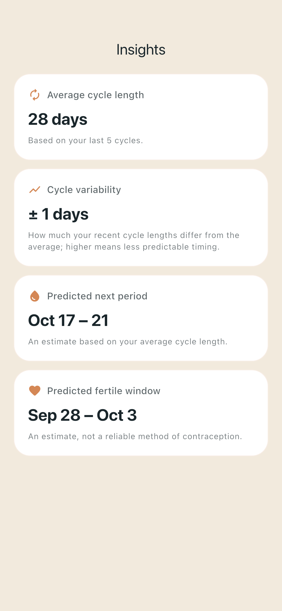

  

<h1 align="center">Inner Flare</h1>

  <strong>A private period and cycle tracker. No account, no cloud, no network. What you log stays on your phone.</strong>

  <a href="https://play.google.com/store/apps/details?id=org.healthflare.app.innerflare">Google Play</a> ·
  <a href="https://github.com/Health-Flare/InnerFlare/releases/latest">Latest release</a> ·
  <a href="https://healthflare.org/inner-flare/">healthflare.org/inner-flare</a>

  
  
  
  

  
  
  

## What it does

Log your period, flow, symptoms, and a note in a few taps. Inner Flare shows your history on a calendar and estimates your next period from your own past cycles. The estimates are plain statistics, and the app shows you what they're based on.

Choose which symptoms you track and arrange the dashboard the way you want it. When you want a copy of your data, export it. Nothing leaves the device any other way.

Inner Flare is not a medical device and isn't for contraception. Predictions are estimates, not advice.

Why it exists: [Why Inner Flare exists](https://healthflare.org/inner-flare/blog/why-inner-flare-exists/).

## Privacy

- No account. No login.
- No network access at all. No cloud sync, no analytics, no ads.
- Your data is encrypted on the device. With a screen lock set, the phone only releases the key after Face ID, fingerprint, or your passcode. Without one, anyone holding the phone can open the app, and the app says so.
- It's excluded from phone backups. The only way data leaves is when you export it.

Full policy: [healthflare.org/inner-flare/privacy](https://healthflare.org/inner-flare/privacy).

## Get it

- **Android:** [Google Play](https://play.google.com/store/apps/details?id=org.healthflare.app.innerflare), or the APK from [GitHub Releases](https://github.com/Health-Flare/InnerFlare/releases/latest)
- **iPhone:** in App Store review
- **F-Droid:** planned

## Help and feedback

- Found a bug or want something? [Open an issue](https://github.com/Health-Flare/InnerFlare/issues/new).
- Anything that looks like a way data could leave the device, or the lock could be bypassed: please don't open a public issue. Email development@automatedbytes.com.

## Support the project

Inner Flare is free, with no ads and no data to sell. If it helps you, you can [sponsor Health Flare on GitHub](https://github.com/sponsors/Health-Flare). Other ways to give, and where the money goes, are in [FUNDING.md](FUNDING.md).

## Contributing

Contributions are welcome. Start with [CONTRIBUTING.md](CONTRIBUTING.md) for the ground rules, then [docs/development.md](docs/development.md) to build and run the app. Behaviour is specified in plain-language Gherkin files in [`docs/features/`](docs/features/), which double as a readable tour of what the app does.

Built with Flutter, Riverpod, and SQLCipher.

Inner Flare is part of [Health Flare](https://github.com/Health-Flare/app), a family of privacy-first health apps.

## License

Inner Flare is free software under the GNU GPL v3.0 or later. See [LICENSE](LICENSE). Third-party licenses are in [NOTICE.md](NOTICE.md) and in the app under **Settings → Open source licenses**.
